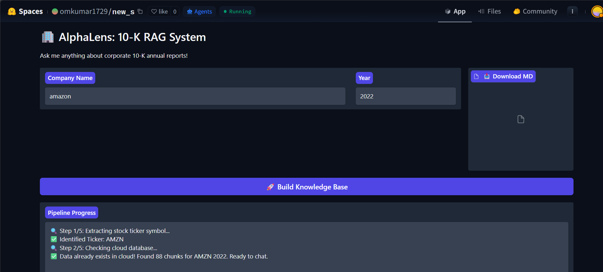
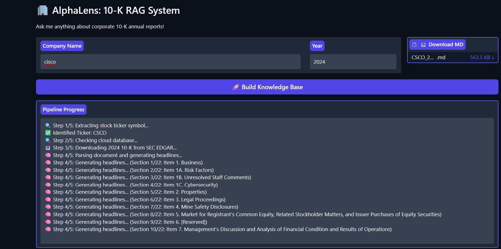
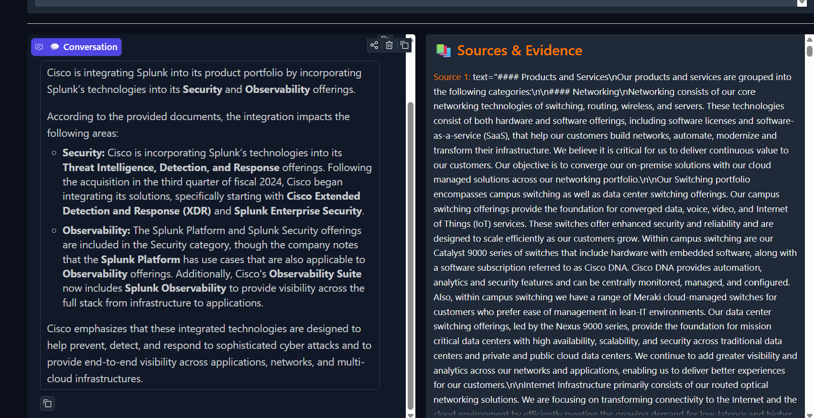
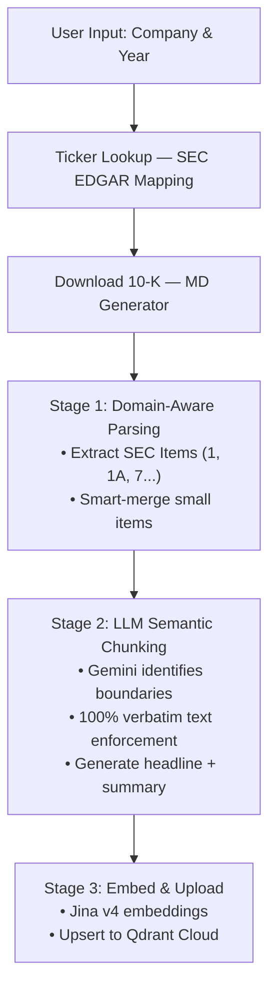
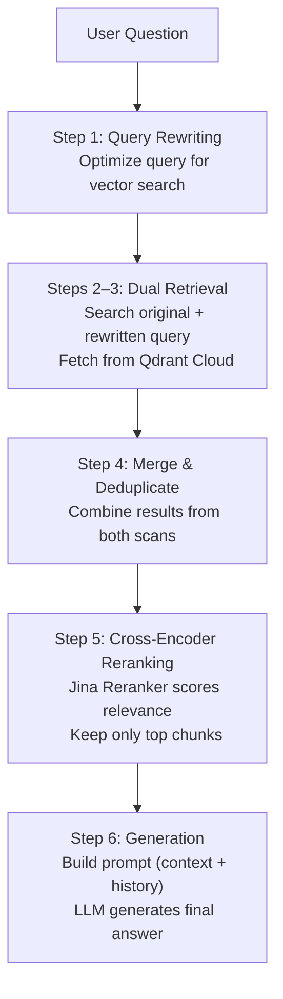

# 🏢 AlphaLens

### Financial Retrieval-Augmented Generation for SEC 10-K Filings

Build a searchable knowledge base from SEC annual reports using
structure-aware parsing, semantic chunking, and multi-stage retrieval.

[](https://huggingface.co/spaces/omkumar1729/new_s)

[](https://www.python.org/downloads/)
[](https://gradio.app/)
[](https://ai.google.dev/)
[](https://qdrant.tech/)
[](https://jina.ai/)
[](https://huggingface.co/spaces/omkumar1729/new_s)
[](LICENSE)

Stop settling for generic, hallucination-prone RAG pipelines. AlphaLens is a multi-stage Retrieval-Augmented Generation engine built specifically for SEC 10-K annual reports.

---



---

## 📸 See it in Action

| Knowledge Base Creation | Financial Q&A |
| :---------------------: | :-----------: |
|  |  |
| *Download, parse, chunk, embed, and build the vector database with live pipeline logs.* | *Ask financial questions and inspect the supporting source chunks used to generate every answer.* |

---

## 🚀 At a Glance

- 📄 Structure-aware SEC parsing
- 🧠 Semantic chunking with text-fidelity validation
- 🔍 Dual retrieval + query rewriting
- 🎯 Cross-encoder reranking
- 📚 Source-grounded answers

---

## Why AlphaLens?

Most Retrieval-Augmented Generation systems are designed for blogs,
documentation, and knowledge bases.

SEC filings are fundamentally different.

They contain hierarchical sections, financial tables,
legal disclosures, and long contextual dependencies that
should not be broken into arbitrary chunks.

AlphaLens was built specifically for these documents.

> **Note**
> Chunk extraction is validated against the source filing. Final answers are still generated by an LLM and should always be verified using the cited source chunks.

---

## ✨ Key Features

Most RAG tutorials treat a 10-K like a generic PDF — blindly slicing it into 500-token chunks, destroying tables, splitting paragraphs mid-sentence, and hoping the LLM figures it out. That doesn't work for finance.

| | |
|---|---|
| 🧠 **Domain-Aware Parsing** | Maps the document by SEC Items (1, 1A, 7...) instead of splitting by word count, keeping related financial context together. |
| 🔒 **Verbatim Semantic Chunking** | An LLM identifies semantic boundaries, but 100% verbatim text preservation is strictly enforced — no dropped tables, no paraphrased risk factors. |
| 🏷️ **Auto-Enriched Metadata** | Every chunk gets an LLM-generated headline and summary, embedded alongside the text for stronger vector search. |
| 🔍 **Advanced 6-Step Retrieval** | Query rewriting, dual retrieval, merging, and cross-encoder reranking find the exact financial detail in the haystack. |
| 🛡️ **Production-grade Resiliency** | Aggressive retry logic, rate-limit handling, and cold-start management — built to run reliably. |

---

## 🏗️ Architecture

### 1. Ingestion Pipeline — building the knowledge base

Takes a company name, downloads the raw SEC filing, and converts it into a structured, searchable vector database.



### 2. RAG Orchestrator — answering questions

Every question runs through a 6-step pipeline designed to maximize accuracy and minimize hallucination.



---

## 🛠️ Tech Stack

| Category | Technology | Purpose |
| :--- | :--- | :--- |
| **Frontend** | Gradio | Real-time UI for ingestion logs, chat, and source viewing |
| **LLM Orchestration** | LiteLLM | Unified interface for LLM providers (Gemini) |
| **LLM (Chunking/RAG)** | Google Gemini 3.1 Flash Lite | Semantic boundary detection & answer generation |
| **Embeddings** | Jina Embeddings v4 | High-accuracy financial text vectorization |
| **Reranking** | Jina Reranker (Cross-Encoder) | Precision scoring of retrieved chunks |
| **Vector Database** | Qdrant Cloud | Scalable, production-ready vector storage & search |
| **Data Validation** | Pydantic | Enforcing strict JSON schemas for LLM outputs |
| **Resiliency** | Tenacity | Retries & exponential backoff for API/DB timeouts |
| **SEC Data** | edgartools | Downloading structured 10-K filings from EDGAR |

---

### Example Workflow

```text
┌──────────────┐
│ Company Name │
└──────┬───────┘
       │
       ▼
 Download 10-K
       │
       ▼
 Structure-aware Parsing
       │
       ▼
 Semantic Chunking
       │
       ▼
 Jina Embeddings
       │
       ▼
 Qdrant
       │
       ▼
 User Question
       │
       ▼
 Query Rewrite
       │
       ▼
 Retrieval
       │
       ▼
 Reranking
       │
       ▼
 Final Answer
```

---

## 💡 How To Use

1. **Build the knowledge base** — type a company name (e.g. "jp morgan", "nvidia") and year (e.g. 2024), then click **🚀 Build Knowledge Base**. Watch the real-time logs as it processes the 10-K.
2. **Download the raw data** — once processing finishes, a download button for the raw `.md` file appears.
3. **Chat** — ask complex financial questions, e.g. *"What are the primary risk factors related to regulatory changes?"*
4. **Verify sources** — the right panel shows the exact Item, headline, and text chunk the AI used. No blind trust.

---

## ⚙️ Getting Started

**1. Clone the repository**
```bash
git clone https://github.com/YOUR_USERNAME/AlphaLens.git
cd AlphaLens
```

**2. Create a virtual environment & install dependencies**
```bash
python -m venv .venv
# Windows
.venv\Scripts\activate
# Mac/Linux
source .venv/bin/activate

pip install -r requirements.txt
```

**3. Set up environment variables**

Create a `.env` file in the root directory:
```env
# Gemini API (chunking & RAG LLM)
GEMINI_API_KEY=your_gemini_api_key_here

# Jina AI API (embeddings & reranking)
jina=your_jina_api_key_here

# Qdrant Cloud (vector database)
QDRANT_URL=https://your-cluster-url.aws.cloud.qdrant.io
QDRANT_API_KEY=your_qdrant_api_key_here
```

**4. Launch the app**
```bash
python app.py
```
Then open `http://localhost:7860`.

---

## 📂 Project Structure

```text
AlphaLens/
├── app.py                  # Gradio UI (main entry point)
├── master_pipeline.py      # Core ingestion orchestrator
├── ticker_extractor.py     # Company name → SEC ticker mapping
├── MD_Generator.py         # Downloads raw 10-K markdown from SEC EDGAR
├── requirements.txt
│
├── ingest/                 # Data processing pipeline
│   ├── parsing.py          #   Stage 1: SEC item extraction & merging
│   ├── stage_2_worker.py   #   Stage 2: LLM semantic chunking (Gemini)
│   └── stage_3_embed.py    #   Stage 3: Jina embeddings + Qdrant upload
│
├── rag_orchestrator/       # 6-step RAG engine
│   ├── pipeline.py         #   Connects all 6 steps
│   ├── rewrite.py          #   Step 1: query rewriting
│   ├── retriever.py        #   Steps 2–3: dual vector search
│   ├── merger.py           #   Step 4: dedup & merge
│   ├── reranker.py         #   Step 5: cross-encoder reranking
│   ├── prompt_builder.py   #   Step 6a: context & history formatting
│   ├── generator.py        #   Step 6b: final answer generation
│   ├── schema.py           #   Pydantic data models
│   └── config.py           #   LLM & Qdrant configuration
│
├── finance_db/             # Local database storage
├── Knowledge-base/         # Raw 10-K markdown storage
└── stage_1_json/, stage_2_json/   # Pipeline caching for resilience
```

---

## 📄 License

This project is licensed under the MIT License — see the [LICENSE](LICENSE) file for details.

